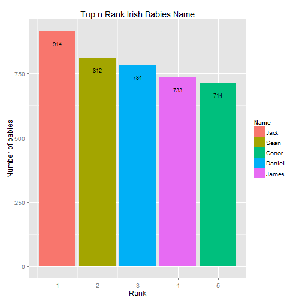

## Advantage of the Ranking of Baby Names

Every parents surely want to give the best names for their baby. Usually they will look up from baby names dictionary and see the meaning of the names. We hope that by visualize the Top n Rank of Baby names for given year, parents can use this as reference of what is the most popular baby names for every given year.

Chosen the most popular baby names may not be always the option by most parents since they sometimes want to give a unique names instead.

--- .class #id 

## Process the Data

The data was downloaded from Central Statistics Office. The data then further pre-processed into a useful format using R and a px package than can be visualized in the plot diagram. 
Specifiy the following using slider bars & dropdown box:
- Year (e.g. 2013)
- Sex ( Male, Female, Both)
- Top n Ranks ( e.g. 3 ranks)

Below is the result of compiling year='2010', sex='Male', Top n Rank='5'


```
##     Year   Name Rank Amount
## 25  2010   Jack    1    914
## 57  2010   Sean    2    812
## 89  2010  Conor    5    714
## 121 2010 Daniel    3    784
## 153 2010  James    4    733
```


--- .class #id 

## Graph Visualization

And the data will be visualized in nice graph below. If sex chosen is 'both', the graph will be stacked bar chart.

 

--- .class #id 

## More Details

This applet uses data available from the Central Statistics Office in order to generate graphs on the most popular baby names in Ireland for specific years. 

("http://www.cso.ie/px/pxeirestat/database/eirestat/Irish%20Babies%20Names/Irish%20Babies%20Names_statbank.asp")

It was written in R and hosted by shiny apps at https://efge.shinyapps.io/TopRankIrishBabyNames/

--- .class #id 


